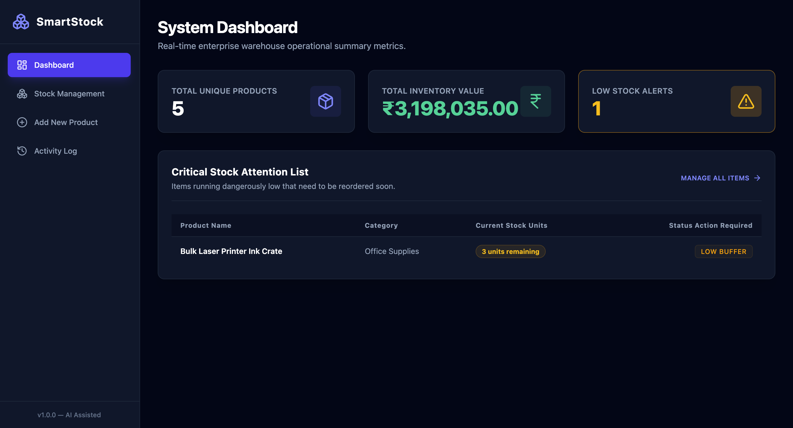
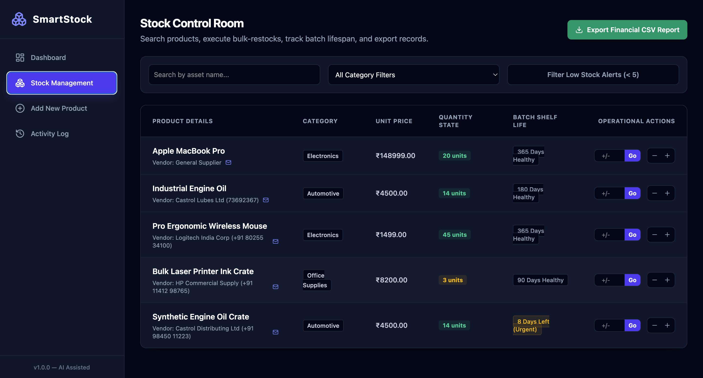
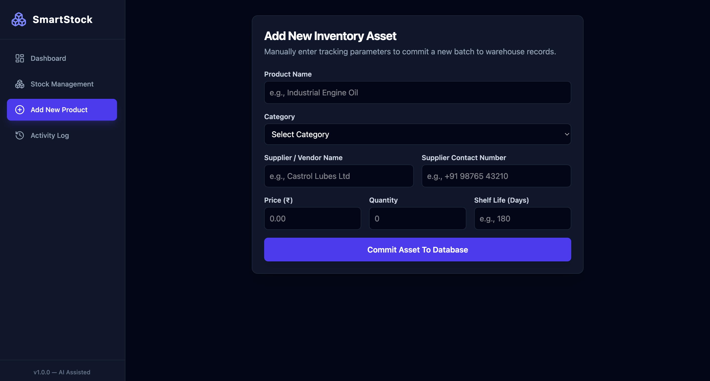
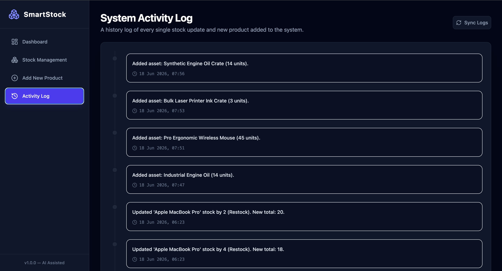

# SmartStock: Inventory Management System

A full-stack web application designed to streamline warehouse inventory tracking, prevent stock stagnation, and simplify vendor coordination. This project implements a completely decoupled architecture with a React frontend and a Python Flask backend.

---

## 🚀 Core Deliverables & Features

This system successfully delivers all the core requirements specified in the project assignment:

### 1. What Was Requested & Delivered
* **Product & Stock Tracking:** A dynamic inventory table that displays current items, stock levels, and item statuses in real-time.
* **Supplier Contact Registry:** Integration of vendor details directly into the product tracking flow, capturing critical information like supplier names and contact numbers.
* **Automated Shelf-Life Alerts:** Active monitoring of batch dates that flags items sitting on shelves for too long to prevent financial loss from dead stock.
* **Bulk Transaction Modifiers:** Quick-action controls allowing users to adjust inventory volumes instantly without navigating through complex sub-menus.
* **Audit-Ready Data Pipelines:** A dedicated data export feature that compiles current inventory states into clean, downloadable CSV sheets for accounting and audits.

### 2. Additional Enhancements (Going Above & Beyond)
* **Decoupled Architecture:** Completely separated client (`frontend/`) and server (`backend/`) environments for better maintainability and professional codebase organization.
* **Visual UI/UX Layout:** Built with a clean, responsive sidebar navigation dashboard using Tailwind CSS to mimic modern enterprise tools.
* **Clean Data Management:** Powered by a relational SQLite database to ensure structured data storage and reliable lookups.

---
## 🚀 Core Deliverables & Features

This system successfully delivers all the core requirements specified in the project assignment, seamlessly mapping user interface states to our backend data pipelines:

### 1. High-Level Summary Dashboard
The entry point of the system provides an immediate operational summary of warehouse metrics. It calculates the total inventory value and isolates critical attention items dynamically, giving warehouse managers an instant overview of system status.



### 2. Core Stock Management & Operational Math
The main control room features a dynamic inventory table displaying active stock counts, structural category filtering, and rapid-response bulk stock modifiers (+/- incrementors). It directly links each asset line to vendor data and color-coded real-time batch shelf-life alerts to stop inventory stagnation.



### 3. Integrated Supplier Contact Registry & Asset Forms
A structured input layout built to maintain complete data accountability. Every new inventory asset committed to the relational database enforces validation across the product name, volume, cost parameters, and matching vendor communication handles (name and phone number string).



### 4. System Activity Logs & Audit Exports
To maintain absolute compliance, the system records sequential operations in an immutable chronological activity timeline tracker. For accounting and reporting workflows, managers can trigger the primary reporting pipeline to instantly compile active states into a downloadable financial CSV sheet.



---

## 🛠️ Technology Stack Used

* **Frontend:** React, Vite, Tailwind CSS (for modern components and fast, responsive styling)
* **Backend:** Python, Flask, Flask-CORS (for a lightweight, efficient REST API pipeline)
* **Database:** SQLite (built-in relational database, local storage tracking via `inventory.db`)

---

## 📝 Development Assumptions

During development, the following practical assumptions were made to keep the system efficient and user-friendly:
1. **Local Environment Focus:** The database utilizes a local SQLite file (`inventory.db`) inside the backend folder for fast setups without requiring external cloud configurations.
2. **Single-User Scope:** The dashboard assumes a single-user manager persona running warehouse operations; user authentication/login was intentionally left out of scope to focus purely on functional asset management.
3. **Data Completeness:** It is assumed that every inventory item must be tied to a vendor name and contact string to ensure accountability.

---

## 🤖 AI-Assisted Development Note

### How AI Was Used
During the development of this project, AI tools (specifically Google Gemini) were utilized to accelerate both the frontend layout and backend API design. AI was incredibly helpful for generating the baseline boilerplate code for the React components (`StockTable`, `AddProduct`) and setting up the initial Flask routing structure. Instead of spending hours looking up Tailwind CSS syntax or structuring standard Python SQL queries, AI helped instantly write clean snippets, allowing me to focus on stitching the full-stack system together and refining the business logic.

### Challenges Encountered & Solved
The primary challenge faced during development was managing the data communication between the frontend React application and the backend Flask server. Initially, the frontend requests were being blocked due to Cross-Origin Resource Sharing (CORS) security restrictions. By using AI to troubleshoot the exact console error logs, I learned how to properly implement `flask_cors` on the backend server to authorize frontend communication. Another challenge was perfecting the local database path generation within Flask's instance folders, which was resolved by standardizing the folder hierarchy and updating the `.gitignore` rules to keep development caches secure and isolated from the Git history.

---

## 💻 System Setup & Run Instructions

To run this full-stack application locally on your computer, follow these simple steps:

### Prerequisites
* Make sure you have **Node.js** and **Python 3** installed on your machine.

### 1. Backend Setup (Flask API)
Open your terminal, navigate to the `backend` directory, and run:
```bash
# Move to backend folder
cd backend

# Create a virtual environment (if not already done)
python3 -m venv inventoryVENV

# Activate the virtual environment
source inventoryVENV/bin/activate

# Install required Python dependencies
pip install -r requirements.txt

# Start the local Flask development server
python app.py
